# Build a rhythm game in Godot! (Draft)

Let's make a rhythm game with Godot!

By the end of this guide, you'll have made a multi-lane rhythm game where notes fall from the top of the screen. In other words, a standard rhythm game. At the end, our game will look something like this:


## Setup

First, download and install Godot from [the official website](https://godotengine.org/download/). (You can also try using the [web editor](https://editor.godotengine.org/), though it has some instabilities.)

When you open Godot, you should see a screen like this.


Click "Create" on the top left corner. Give your project a name (e.g., "My Rhythm Game"), choose the "Compatibility" platform, then click "Create".


## Godot overview

You should now be greeted with the screen below


The Godot editor is split into a few regions:

- The bottom left is the **filesystem**, where you can drag in resources like images, audios, etc. to add them to your project.
- The top left is the **scene tree**, which contains the "nodes", or contents, of the current scene. A **scene** is either a screen in your game, like your main menu or main game, or a reusable component, like a player or an enemy.
- The right side is the **inspector**, where you can change the properties of your nodes, like their positions and the audio that a media player is currently playing.
- Finally, the center is the **canvas**, which is where you can visually edit your scene.

Now it's time to make our game! It's going to have **lanes**, the individual vertical strips that notes fall from; **notes**, the things that fall from the top following the beat; and a **judgement line** at the bottom-ish of the screen. When notes reach the judgement line, the player has to press a key on their keyboard that corresponds to the lane.

## Configuring our game

First things first: let's do some configuration. Open "Project > Project Settings..." on the top toolbar, and under the "General" tab, search for "viewport". Change the value of "Viewport Width" to `1280` and "Viewport Height" to `720`. (This is so we know for sure what the size of the window is.)


Then, search for "stretch". Change the value of "Stretch > Mode" to "canvas_items". (This is so resizing the window of our game scales it automatically, instead of making the viewport bigger.)


While we're here, let's also define the keys that the player will be pressing! Switch to the "Input Map" tab. This is where you will define the actions that pressing each key corresponds to.

We'll add four actions for each of the four lanes in our game; for simplicity, we'll call these actions "1", "2", "3", and "4". To add an action, type its name in the "Add New Action" box near the top of the window, and press "+ Add" (or press Enter).


Next, we'll assign keyboard keys to each of these actions. I'll assign the 1 to 4 number keys, but you can choose any keys you'd like! To do this, press the "+" icon next to each of the actions we just added (it's on the far right). Then, press the key you want to associate this action to. (Just press the key, don't type its name out!) Then, click "OK" to save.


After the configuration, the Input Map tab should look something like this.


Now you can close the Project Settings window. And it's finally time to...

## Music & beats

... start coding our game!

First things first: we won't be making a 3D rhythm game (though it might be a fun idea). On the top of your editor, switch to the "2D" tab. Next, you should see a purple-ish rectangle on the canvas. This is the size of your viewport; things outside this rectangle won't be shown. Pan the editor canvas with your middle mouse button and zoom with the scroll wheel until the viewport is center and large on your screen.


With that out of the way, we can create our main scene! It will be 2D, so select "2D Scene" in the scene tree section of the editor (the top left). Now, save it with Cmd/Ctrl+S, and name your scene "main.tscn".

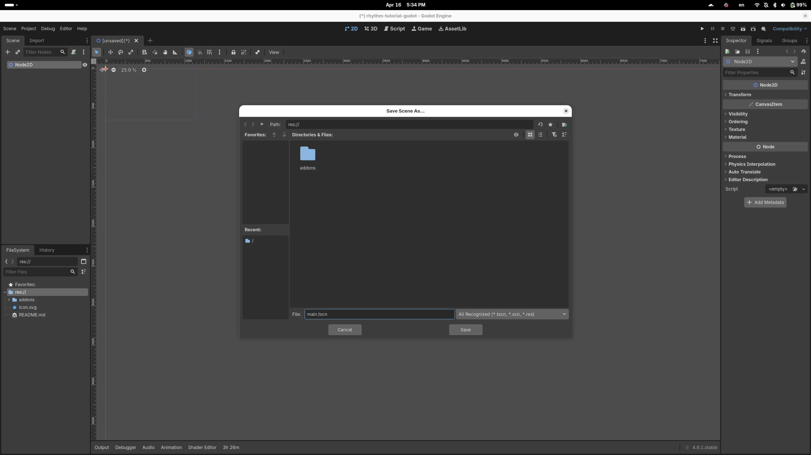

What's a rhythm game without music? We need a music player to play the track for us and to track the beat of the song. In my rhythm games, I call this component the "conductor". On the scene tree, select the "+" button on the very top-left corner (or press its shortcut, Cmd/Ctrl+A), and search for "AudioStreamPlayer". Add it to your scene. (Make sure you don't select "AudioStreamPlayer2D" instead! It contains proximity features we don't need for our project.)

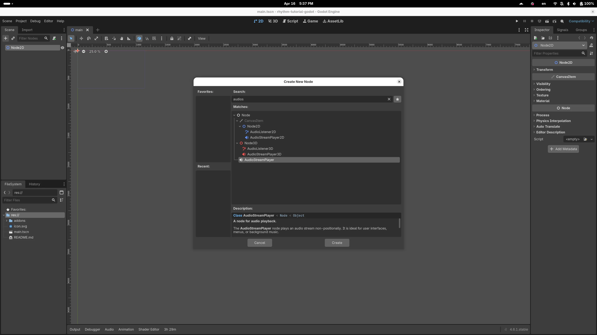

Next up, we'll configure our music player. Double click on your newly created AudioStreamPlayer in the scene tree and rename it to "Conductor". Then, in the inspector to the right of the window, check the "Autoplay" option so our music starts playing immediately.

But hey, how do we add music? It's easy! First, drag a song to the filesystem to the bottom left of the window. Then, drag the imported song to the "Stream" slot in the inspector (where it says "&lt;empty>" now). I'll be using [this song](./16-Bit%20Beat%20Em%20All%20_Clement%20Panchout.wav); you can use the same one to follow along, or you can use your own (but you'll need to figure out the BPM yourself)!

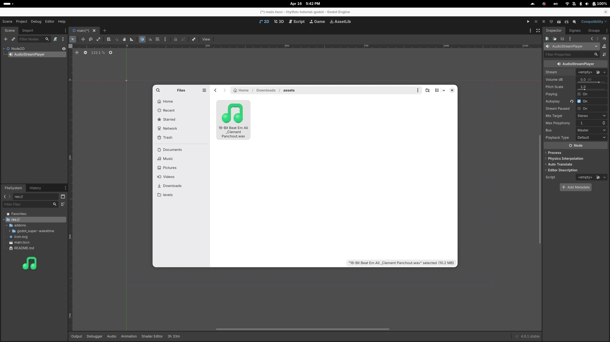

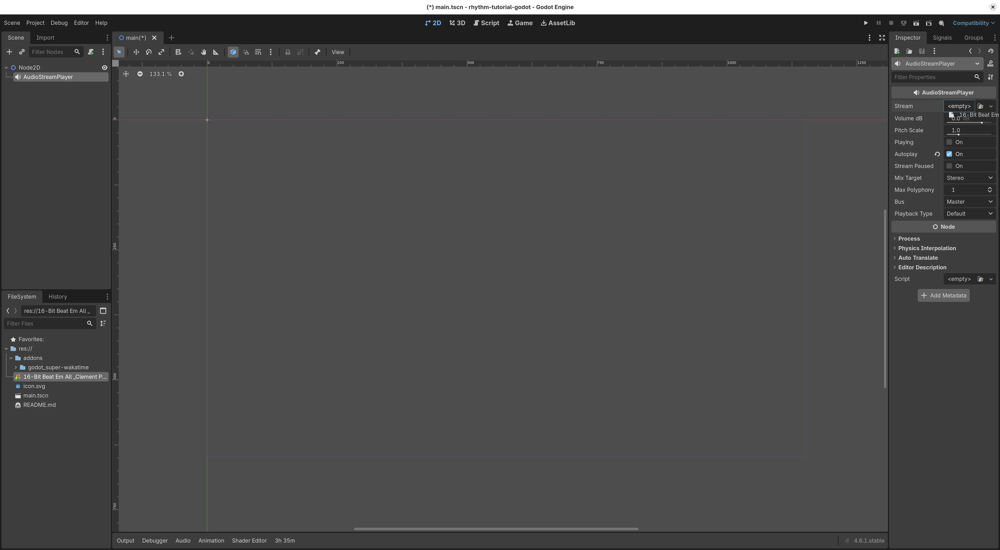

Your finished configuration should look like this.

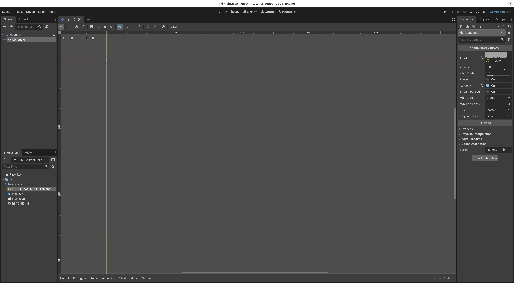

Now, we need to teach the conductor how to count beats. To do this, we need to attach a **script** to the conductor. Godot uses GDScript as its scripting language, which is easy to learn and quite similar to Python.

To attach a script, select the conductor in the scene tree, and press the icon that looks like a scroll with a plus sign. In the popup window, leave everything as default and select "Create".

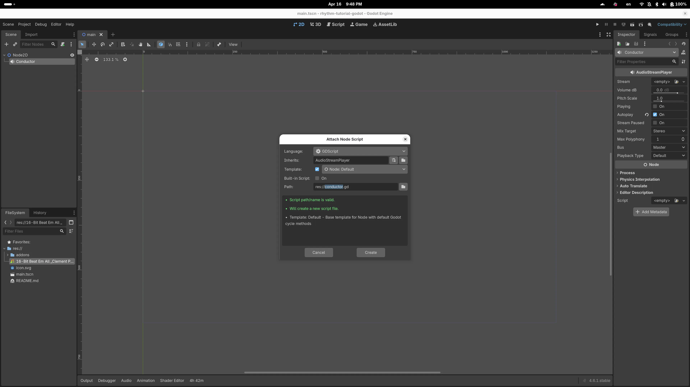

You should be greeted with this screen:

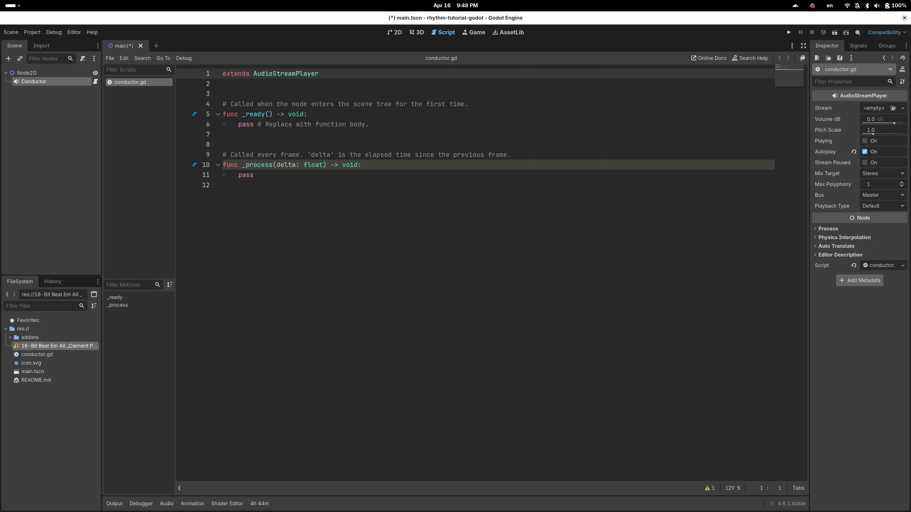

Here, `func` defines a **function**. `_ready` is a special function that will be called "when the node enters the scene tree for the first time"; in other words, when the scene is initialized. `_delta` is a special function that will be called on every single frame of your game. Lines that start with a `#` are comments and are ignored by Godot.

Remember, we need the conductor to track the current beat so all the other parts of our game can function. To do this, it needs to know the BPM! At the start of the script, below `extends AudioStreamPlayer`, add this line:

```gdscript
@export var bpm = 120
```

This creates a **variable** called `bpm` that you can set in the inspector. After you save the script with Cmd/Ctrl+S, you should be able to see the newly created variable on the right hand side! Set this to the BPM of the song you chose. If you used the song I did, the BPM is 162.

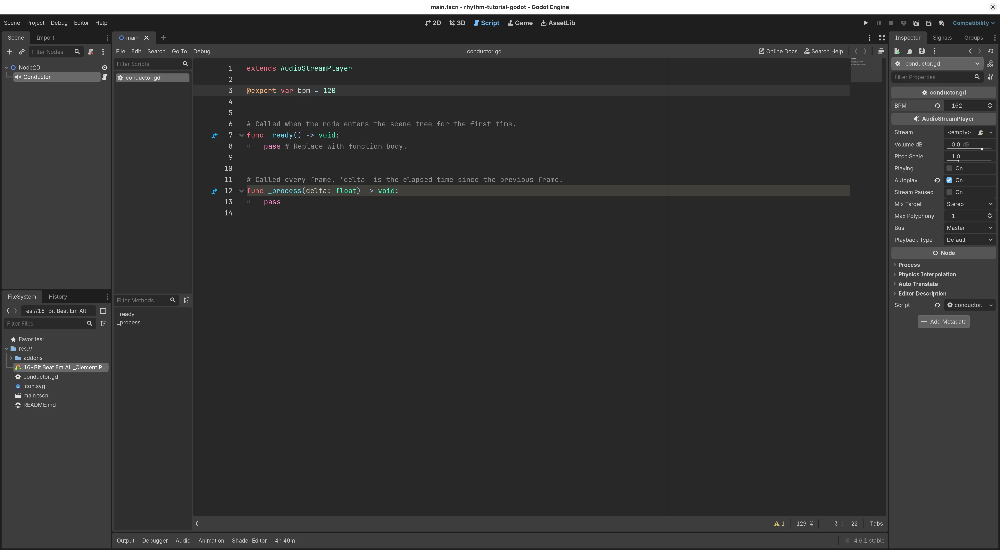

Now, we need the conductor to actually calculate the beat on every frame. We'll use the formula `beat = song position (in seconds) x BPM / 60`. In the `_process` function, remove the `pass` statement (which literally means "do nothing" just like in Python) and add the following:

```gdscript
func _process(delta: float) -> void:
    beat = get_playback_position() * bpm / 60
```

When you save, you'll see that Godot gives an error!

```plaintext
Error at (13, 5): Identifier "beat" not declared in the current scope.
```

This is because we tried to store a value into a variable, `beat`, which is not declared. In GDScript, unlike Python, you need to declare variables you use using `var` (you've already seen this with the BPM!). Since we want the other parts of your game to access this variable, we'll declare it in the file's global scope, instead of in the `_process` function. Add this code below your BPM variable:

```gdscript
var beat := 0.0
```

Now, the error is gone, and your conductor is complete! Congratulations! Your final code should look like this:

```gdscript
extends AudioStreamPlayer

@export var bpm = 120

var beat := 0.0


# Called when the node enters the scene tree for the first time.
func _ready() -> void:
    pass # Replace with function body.


# Called every frame. 'delta' is the elapsed time since the previous frame.
func _process(delta: float) -> void:
    beat = get_playback_position() * bpm / 60
```

Since the `_ready` function is unused, you can remove it from your code, or you can keep it there; it won't do anything.

Alright, time to make the lanes and the notes!

## Drawing the game

Don't worry, you won't be the one doing the drawing (I can't draw at all). Godot will! You just need to tell it how to do that.

If you think about our game interface, there are only a few things we need to display:

- Five vertical lines that create four lanes for the notes to fall
- Four labels that tell the players what keys to press
- A horizontal judgement line
- The individual notes themselves
- A current score label

Let's draw them one by one!

First, attach a script to the root node of your scene, which is probably called something like "Node2D".

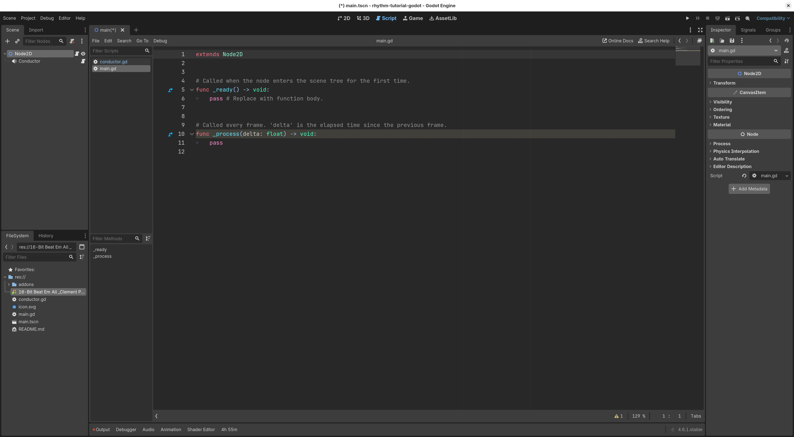

Now, add a function called `_draw`. This is where we'll be drawing our game interface. (You can add this function anywhere; I'll put it below `_ready` and `_process`.)

```gdscript
func _draw() -> void:
    pass
```

We'll now draw the elements one by one. First, the vertical lines and the key labels: (You should add each of these code blocks below to the body of the `_draw` function, which means you'll need to indent them appropriately.)

```gdscript
for i in 5:
    var start = Vector2(100 * i + 200, 0)
    var end = Vector2(100 * i + 200, 720)
    draw_line(start, end, Color.WHITE)
    if i < 4:
        var label_pos = Vector2(100 * (i+0.5) + 200, 620 + 30)
        draw_string(ThemeDB.fallback_font, label_pos, str(i+1), HORIZONTAL_ALIGNMENT_CENTER)
```

Breaking down this code:

- `for i in 5` means "run the following code for each `i` value from 0 to 4". It's the equivalent of `for i in range(5)` in Python. (In fact, `range` works in Godot too, but you can omit it for brevity.)
- `draw_line` draws a line between two points, represented as `Vector2`s (basically fancy tuples of two numbers).
  - We make each lane 100 pixels wide and leave a 200-pixel blank space on the left side.
- Then, we use `draw_string` to draw the label text. For me, since I used the number keys, it's as simple as `str(i+1)` to get the key corresponding to each lane. If you used different keys, you may need to use an array or a bunch of `if` statements.

Next, we'll draw the judgement line:

```gdscript
var judge_start = Vector2(200, 620)
var judge_end = Vector2(100 * 4 + 200, 620)
draw_line(judge_start, judge_end, Color.WHITE)
```

Not much to talk about here; we set the judgement line at Y=620 and make it span all four lanes.

Next, we'll draw the notes. But wait - we don't have the notes yet! We need to first define where the notes should be.

(P.S. Your code at the end of this section should look like:)

```gdscript
extends Node2D


# Called when the node enters the scene tree for the first time.
func _ready() -> void:
    pass # Replace with function body.


# Called every frame. 'delta' is the elapsed time since the previous frame.
func _process(delta: float) -> void:
    pass


func _draw() -> void:
    for i in 5:
        var start = Vector2(100 * i + 200, 0)
        var end = Vector2(100 * i + 200, 720)
        draw_line(start, end, Color.WHITE)
        if i < 4:
            var label_pos = Vector2(100 * (i+0.5) + 200, 620 + 30)
            draw_string(ThemeDB.fallback_font, label_pos, str(i+1), HORIZONTAL_ALIGNMENT_CENTER)

    var judge_start = Vector2(200, 620)
    var judge_end = Vector2(100 * 4 + 200, 620)
    draw_line(judge_start, judge_end, Color.WHITE)
```

## Defining notes (aka charting)

Our rhythm game will be quite simple, and it'll only have tap notes, where the player will tap a key when the note reaches the judgement line. Thus, we just need to define the lanes that notes will fall from and the beat that it reaches the judgement line.

> **Why do we use beats?** It's the de facto standard to use beats instead of time in rhythm games. It makes things like charting a lot easier, since you don't need to define the timestamp, which may or may not be a whole number. Beats are generally much nicer to work with.

We will define notes by creating a `notes` variable, which is made of an array of arrays. Each of the subarrays represents the notes in a single lane, and the values in these subarrays are the beats at which a note will appear on this lane. If that was a bit confusing, don't worry! Check out this example:

```gdscript
var notes = [
    [2, 7],
    [3, 8],
    [4, 9],
    [5, 10]
]
```

This array defines 8 notes, 2 on each lane. In fact, this creates the staircase pattern that you saw at the very beginning of the guide. You can put this code below the line `extends Node2D`. I encourage you to then tweak the notes yourself to make the game a bit more interesting!

Next, we need to draw in the notes. Back in our `_draw` function, add the following lines:

```gdscript
for i in 4:
    for note in notes[i]:
        var y = 620 + 100 * ($Conductor.beat - note)
        var start = Vector2(100 * i + 200, y)
        var end = Vector2(100 * (i+1) + 200, y)
        draw_line(start, end, Color.WHITE, 5)
```

Breaking down this code:

- We use a nested `for` loop, the outer one to iterate through all four lanes, and the inner one to iterate through each note.
- We calculate the Y coordinate for the note by taking the judgement line's Y coordinate and adding the difference in beats times 100 to it. This means the notes will fall down as its beat draws closer.
  - `$Conductor` references the "Conductor" node that we configured earlier, where we defined a `beat` variable that tracks the current beat.
- We then draw the note as a 5-pixel wide line spanning a single lane.

Now let's try our game! Click the "Play" button on the top right corner. (If it asks you to select a main scene, choose "Select Current".) If everything goes well, you should hear the music playing, and the notes... wait, why aren't they moving?

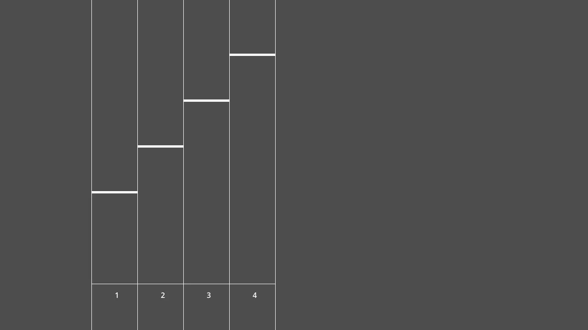

This is because, by default, Godot only calls the `_draw` function once at the start of the scene. To have it update the screen every frame, we need to call the `queue_redraw` function in `_process`. Let's do that by changing the definition of `_process` to:

```gdscript
func _process(delta: float) -> void:
    queue_redraw()
```

Now if you run your game again, the notes should be falling! Congrats! But pressing the keys don't work yet.

## Responding to input

Let's have the keys work! In Godot, one way to handle keyboard input is by using the `_unhandled_key_input` function. This function is called for each keypress that isn't handled by control elements (like buttons, text inputs, etc). In this function, we'll check if each of our four lane keys are pressed, and if they are, we'll remove the first note from that lane. Add the following code at the end of the file:

```gdscript
func _unhandled_key_input(event: InputEvent) -> void:
    if event.is_action_pressed("1"):
        _handle_lane_press(0)
    elif event.is_action_pressed("2"):
        _handle_lane_press(1)
    elif event.is_action_pressed("3"):
        _handle_lane_press(2)
    elif event.is_action_pressed("4"):
        _handle_lane_press(3)


func _handle_lane_press(lane: int) -> void:
    var lane_notes = notes[lane]
    if lane_notes.is_empty():
        return
    lane_notes.pop_front()
```

The code should be relatively straightforward, but take note! The parameter passed to `is_action_pressed` is the **action name** (i.e., the things you defined in the input map), not the keys themselves. In our case, we defined the actions "1", "2", "3", and "4", but if you didn't define them in the Project Settings, this won't catch the keys.

Now if you play your game and press the keys you defined, you should see the notes disappearing!

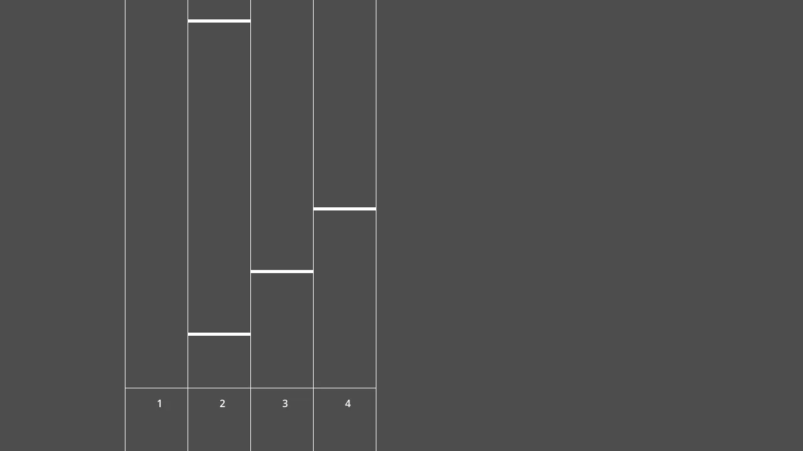

However, there's a bit of a problem... it's not very rhythmical right now. I can literally just spam the keys to hit all of the notes. As you can see from the screenshot, I tapped the 1 key twice and both of the notes on lane 1 got cleared, even though the second one is way far ahead. We need to check if the notes are close enough to hit before removing them! In `_handle_lane_press`, remove `lane_notes.pop_front()` and add the following lines:

```gdscript
var note = lane_notes[0]

if abs($Conductor.beat - note) < 0.5:
    lane_notes.pop_front()
```

This checks if the note is within half a beat of the current music position, and only lets you clear the note if it is. Now you can no longer spam to clear all the notes!

But something else annoying happens: if you miss a note, you can't hit any more notes on that lane in the future. This is because the old note stays in our notes array. We should delete notes that the player has missed! We can do this in `_process`. Add these lines of code to the `_process` function:

```gdscript
for i in 4:
    var lane = notes[i]
    while not lane.is_empty():
        var note = lane[0]
        if note < $Conductor.beat - 0.5:
            lane.pop_front()
        else:
            break
```

This code deletes all the notes in each line that are more than half a beat late, which fixes our problem. You can now play your rhythm game!

By the end of this section, your code should look like this:

<details>
<summary>Click to expand code</summary>

```gdscript
extends Node2D

var notes = [
	[2, 7],
	[3, 8],
	[4, 9],
	[5, 10]
]


# Called when the node enters the scene tree for the first time.
func _ready() -> void:
	pass # Replace with function body.


# Called every frame. 'delta' is the elapsed time since the previous frame.
func _process(delta: float) -> void:
	queue_redraw()

	for i in 4:
		var lane = notes[i]
		while not lane.is_empty():
			var note = lane[0]
			if note < $Conductor.beat - 0.5:
				lane.pop_front()
			else:
				break


func _draw() -> void:
	for i in 5:
		var start = Vector2(100 * i + 200, 0)
		var end = Vector2(100 * i + 200, 720)
		draw_line(start, end, Color.WHITE)
		if i < 4:
			var label_pos = Vector2(100 * (i+0.5) + 200, 620 + 30)
			draw_string(ThemeDB.fallback_font, label_pos, str(i+1), HORIZONTAL_ALIGNMENT_CENTER)

	var judge_start = Vector2(200, 620)
	var judge_end = Vector2(100 * 4 + 200, 620)
	draw_line(judge_start, judge_end, Color.WHITE)

	for i in 4:
		for note in notes[i]:
			var y = 620 + 100 * ($Conductor.beat - note)
			var start = Vector2(100 * i + 200, y)
			var end = Vector2(100 * (i+1) + 200, y)
			draw_line(start, end, Color.WHITE, 5)


func _unhandled_key_input(event: InputEvent) -> void:
	if event.is_action_pressed('1'):
		_handle_lane_press(0)
	elif event.is_action_pressed("2"):
		_handle_lane_press(1)
	elif event.is_action_pressed("3"):
		_handle_lane_press(2)
	elif event.is_action_pressed("4"):
		_handle_lane_press(3)


func _handle_lane_press(lane: int) -> void:
	var lane_notes = notes[lane]
	if lane_notes.is_empty():
		return

	var note = lane_notes[0]

	if abs($Conductor.beat - note) < 0.5:
		lane_notes.pop_front()
```

</details>

## Adding a score

The last thing we'll do together in this guide is adding a score label. For simplicity, we'll increase the score by 1 for each note you hit.

First, we need a variable to store the score. Add this below your note definitions:

```gdscript
var score := 0
```

Then, we need to increment the score whenever the user hits a note on time. Add this code inside the `if abs($Conductor.beat - note) < 0.5` check in `_handle_lane_press`:

```gdscript
score += 1
```

Finally, we need to draw the score text. Add this code to the `_draw` function:

```gdscript
draw_string(ThemeDB.fallback_font, Vector2(60, 60), "Score: " + str(score))
```

This draws the score with the default font at (60, 60). Running our game now, you should see the score counter!

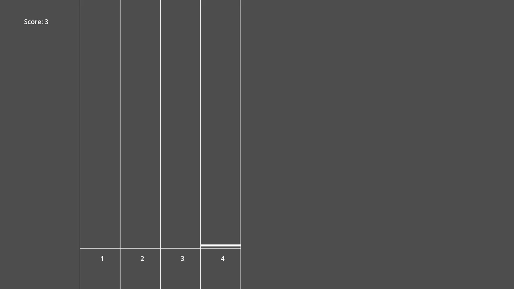

## Conclusion

This concludes this guide for a basic rhythm game! You now have a foundation on which to make the game your own. Some ideas:

- Add a more nuanced scoring system with judgement tiers (Perfect/Good/Bad/Miss)
- Display current and max combo below the score
- Add a pause menu that appears when you press Escape
- Make multiple levels and a menu that lets you select them
- Add assets and colors to make the game look better
- ... and more!

Once you're done, submit your game to [#remixed](https://remixed.hackclub.com)! We can't wait to see what you cook up :D

If you have any questions, feel free to reach out to [@Jolly](https://hackclub.enterprise.slack.com/team/U08CJCZ2Z9S) on the Hack Club Slack!

P.S.: In the coming days/weeks, this guide will be updated and/or extended in include info like how to customize your game, how to make a level editor, etc. Make sure you stay tuned!

~~ Jolly
