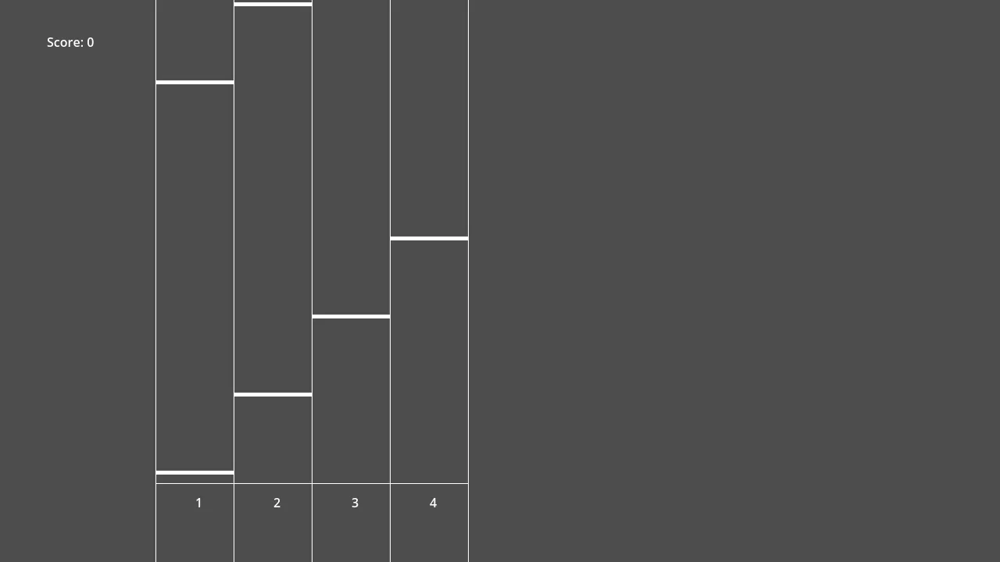
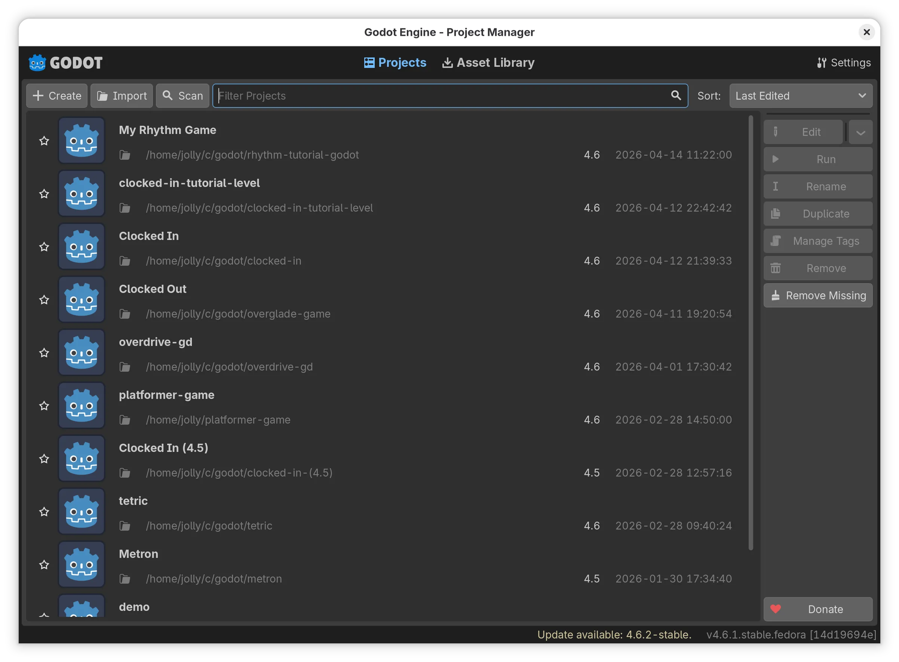
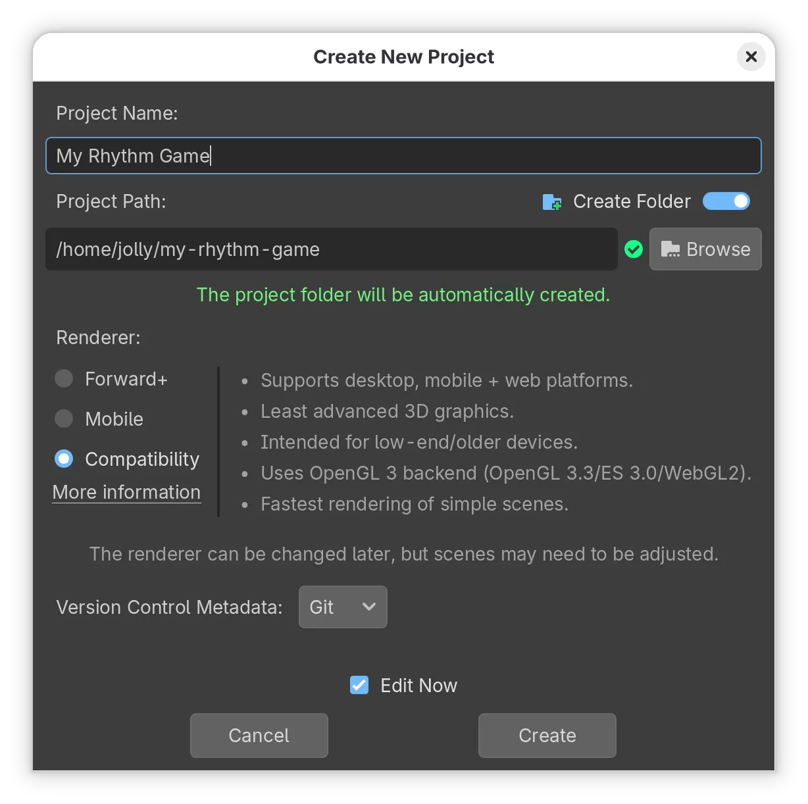
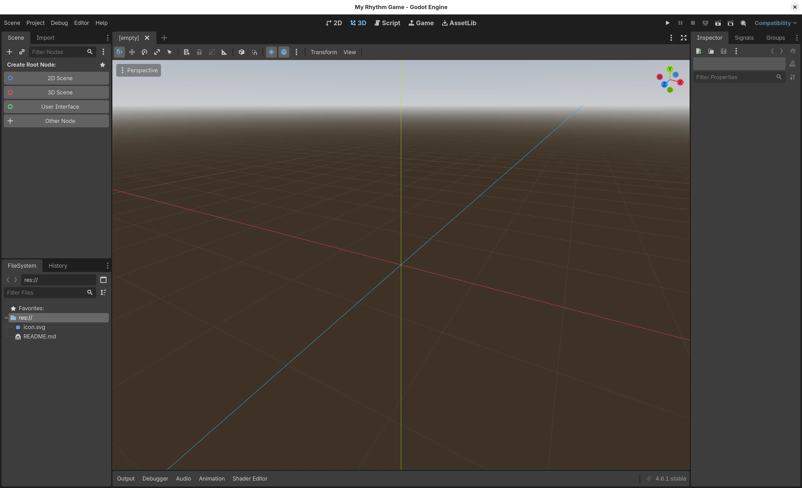
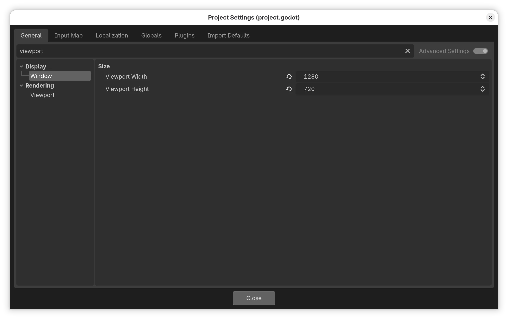
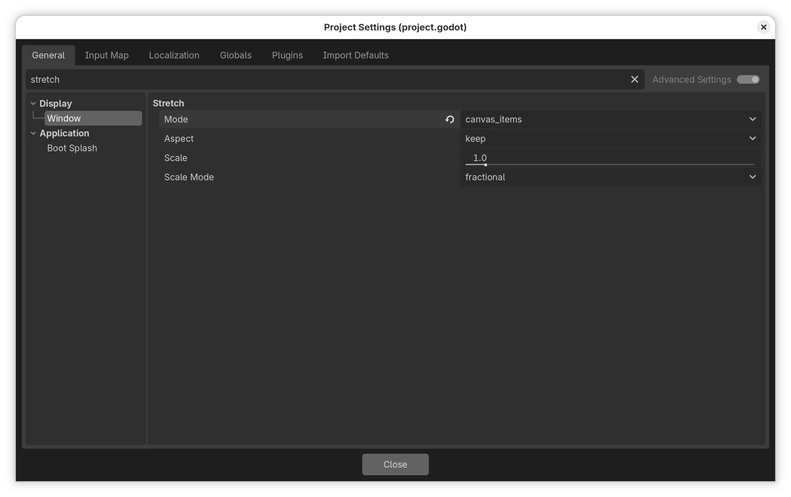
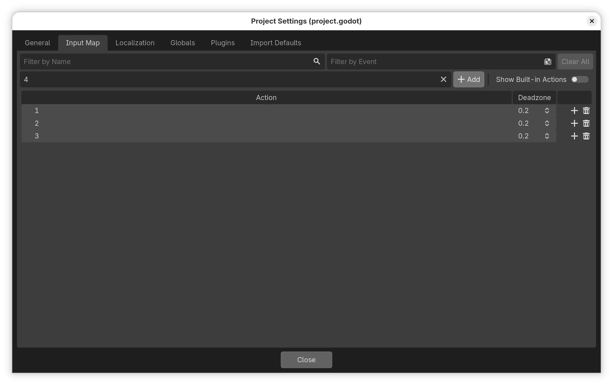
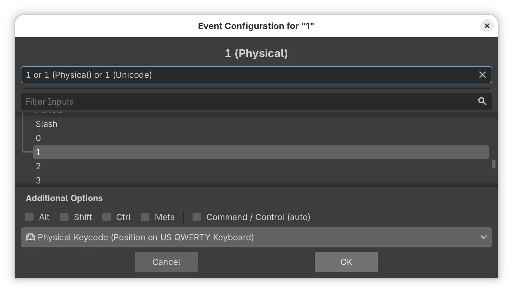
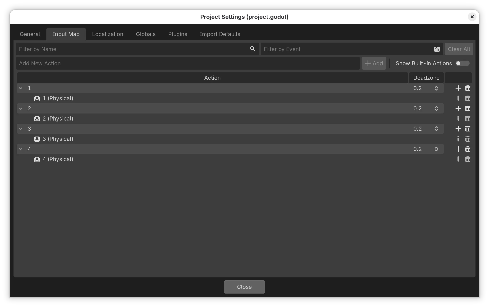
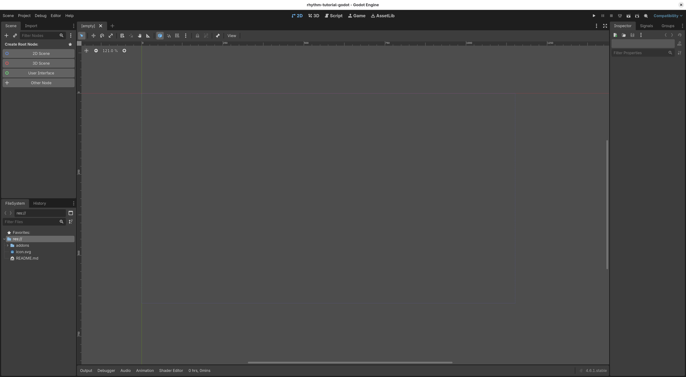

# Build a rhythm game in Godot! (Draft)

Let's make a rhythm game with Godot!

By the end of this guide, you'll have made a multi-lane rhythm game where notes fall from the top of the screen. In other words, a standard rhythm game. At the end, our game will look something like this:

## Setup

First, download and install Godot from [the official website](https://godotengine.org/download/). (You can also try using the [web editor](https://editor.godotengine.org/), though it has some instabilities.)

When you open Godot, you should see a screen like this.

Click "Create" on the top left corner. Give your project a name (e.g., "My Rhythm Game"), choose the "Compatibility" platform, then click "Create".

## Godot overview

You should now be greeted with the screen below

The Godot editor is split into a few regions:

- The bottom left is the **filesystem**, where you can drag in resources like images, audios, etc. to add them to your project.
- The top left is the **scene tree**, which contains the "nodes", or contents, of the current scene. A **scene** is either a screen in your game, like your main menu or main game, or a reusable component, like a player or an enemy.
- The right side is the **inspector**, where you can change the properties of your nodes, like their positions and the audio that a media player is currently playing.
- Finally, the center is the **canvas**, which is where you can visually edit your scene.

Now it's time to make our game! It's going to have **lanes**, the individual vertical strips that notes fall from; **notes**, the things that fall from the top following the beat; and a **judgement line** at the bottom-ish of the screen. When notes reach the judgement line, the player has to press a key on their keyboard that corresponds to the lane.

## Configuring our game

First things first: let's do some configuration. Open "Project > Project Settings..." on the top toolbar, and under the "General" tab, search for "viewport". Change the value of "Viewport Width" to `1280` and "Viewport Height" to `720`. (This is so we know for sure what the size of the window is.)

Then, search for "stretch". Change the value of "Stretch > Mode" to "canvas_items". (This is so resizing the window of our game scales it automatically, instead of making the viewport bigger.)

While we're here, let's also define the keys that the player will be pressing! Switch to the "Input Map" tab. This is where you will define the actions that pressing each key corresponds to.

We'll add four actions for each of the four lanes in our game; for simplicity, we'll call these actions "1", "2", "3", and "4". To add an action, type its name in the "Add New Action" box near the top of the window, and press "+ Add" (or press Enter).

Next, we'll assign keyboard keys to each of these actions. I'll assign the 1 to 4 number keys, but you can choose any keys you'd like! To do this, press the "+" icon next to each of the actions we just added (it's on the far right). Then, press the key you want to associate this action to. (Just press the key, don't type its name out!) Then, click "OK" to save.

After the configuration, the Input Map tab should look something like this.

Now you can close the Project Settings window. And it's finally time to...

## Making our main scene

... start coding our game!

First things first: we won't be making a 3D rhythm game (though it might be a fun idea). On the top of your editor, switch to the "2D" tab. Next, you should see a purple-ish rectangle on the canvas. This is the size of your viewport; things outside this rectangle won't be shown. Pan the editor canvas with your middle mouse button and zoom with the scroll wheel until the viewport is center and large on your screen.

